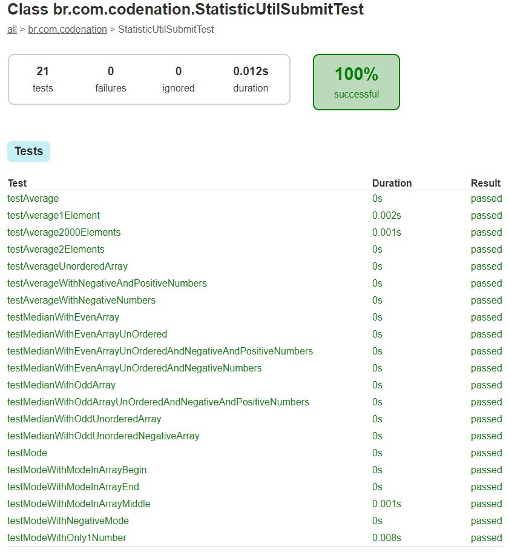

# Calcular Media, Moda e Mediana

Você recebeu a tarefa de criar uma classe utilitária que poderá ser utilizada em vários pontos de sua aplicação. Essa classe deve conter métodos para realizar alguns cálculos comuns em análises estatísticas.
A versão inicial de sua classe deve conter a implementação dos seguintes métodos:

## Média:
O método que terá o nome **average** deve receber um array de inteiros e retornar a média de seus valores. A média pode ser obtida através da soma de todos os valores do conjunto, dividida pela quantidade de elementos do conjunto.

**Exemplo:**
Para um array [1,2,3,4,5], o cálculo da média deverá ser:  15 / 5 = 3 (soma / quantidade = média)

## Moda:
O método que terá o nome **mode** deve receber um array de inteiros e retornar um inteiro contendo o valor da moda do conjunto. A moda é representada pelo valor que mais se repete no conjunto.

**Exemplo:**
Para um array [1,2,2,3,3,4,4,4,5,5,6,7,8], a moda é o número 4 com 3 ocorrências.

**Observação:**
Para fins de simplificação, não deverão ser considerados arrays que possuam mais de 1 número de moda, como por exemplo: [1,1,2,2,4] 

## Mediana:
O método que terá o nome **median** deve receber um array de inteiros e retornar um valor inteiro contendo a mediana do conjunto. A mediana pode ser obtida ordenando os valores no array e pegando o valor que se encontra no meio do mesmo.
Para arrays com quantidade par de elementos, não haverá um único valor no meio, nesse caso a mediana será definida como a média entre os dois valores do meio do array.

**Exemplo:**
Para um array [1,2,3,4,5,6,7], a mediana é representada pelo número 4 que se encontra exatamente no meio da distribuição.
Para um array [1,4,6,10,12,14], a mediana é definida pelo cálculo da média entre 6 e 10, o que significa que teremos: (6 + 10) / 2 = 8

# Resultado submetido

